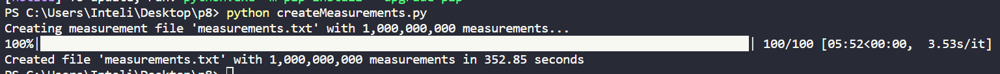
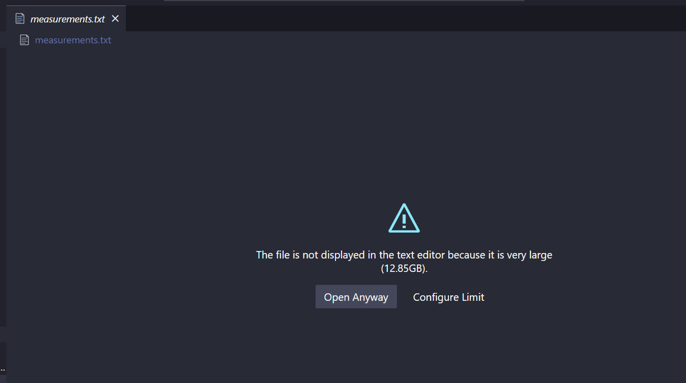
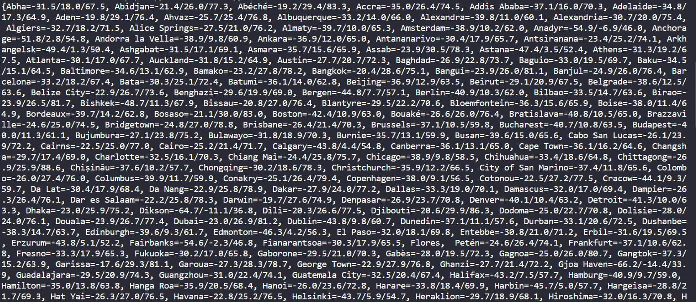

# Ponderada 8

O desafio das "Um Bilhão de Linhas" consiste em criar um arquivo contendo dados de estações e suas respectivas temperaturas, e em seguida calcular as temperaturas mínima, máxima e média.

A implementação desse desafio está baseada no seguinte repositório: https://github.com/ifnesi/1brc#submitting

O processamento desses dados é realizado da seguinte forma:

Utilizando a biblioteca Polars, é feita uma leitura do arquivo CSV, criando um dataframe com os dados.
Os dados são agrupados pela coluna "station_name" e, em seguida, são calculados os valores mínimos, máximos e médios das temperaturas.
Por fim, o resultado é ordenado pelo "station_name".

## Criação do arquivo de um bilhão de linhas

## Resultado do processamento

